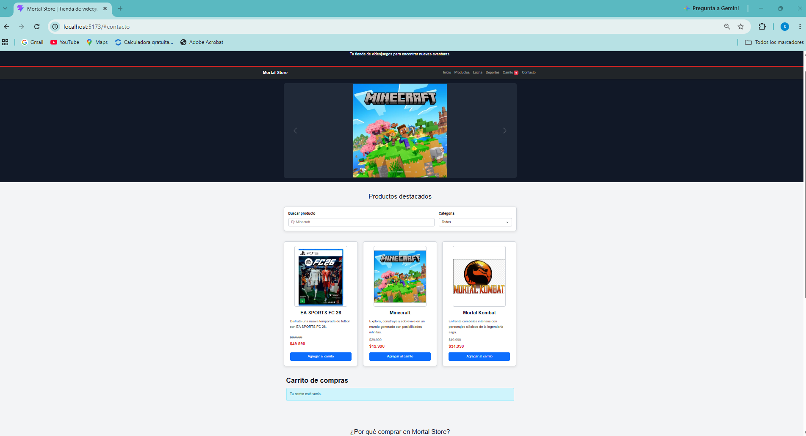
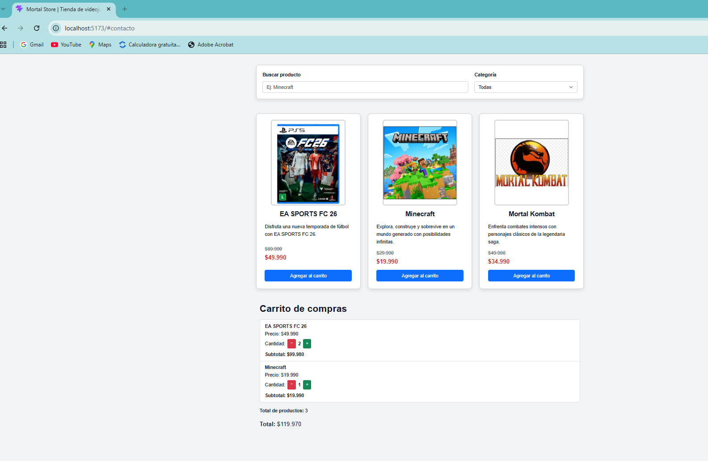
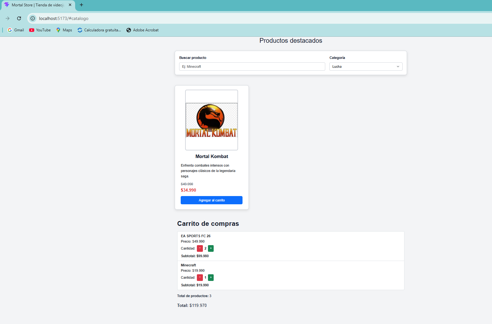
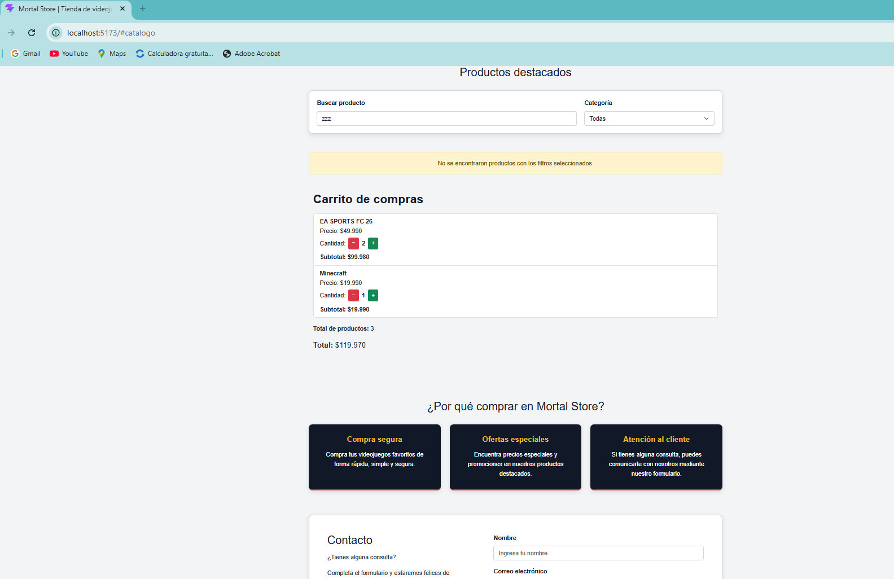
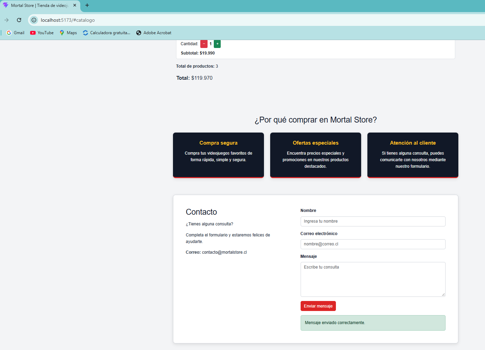
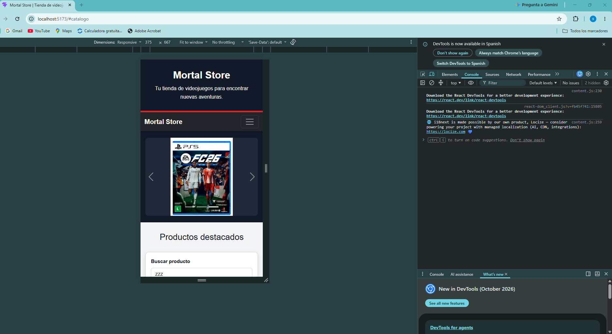

# Bimestre_08_DFI_Exp3_S7_FranciscoHenriquez
# 🎮 Mortal Store

Proyecto desarrollado progresivamente para la asignatura Desarrollo Frontend I (PFY2201).

El proyecto corresponde a la evolución de Mortal Store, una tienda web de videojuegos desarrollada utilizando React, Vite, JavaScript, Bootstrap 5, CSS3 y JSON, incorporando componentes funcionales, manejo de estados, propiedades, eventos, renderizado condicional, filtros de productos y un carrito de compras interactivo.

---

## 🎯 Objetivo del proyecto

El objetivo de esta actividad es desarrollar una aplicación web de comercio electrónico utilizando React, aplicando componentes funcionales y herramientas para el manejo del estado de la aplicación.

La aplicación permite visualizar un catálogo de videojuegos, buscar y filtrar productos, agregar productos al carrito, modificar sus cantidades y calcular automáticamente el total de la compra.

Además, se implementa renderizado condicional para modificar la interfaz de acuerdo con el estado de la aplicación y persistencia del carrito mediante Local Storage.

---

## 🛠️ Tecnologías utilizadas

- HTML5
- CSS3
- JavaScript
- React
- Vite
- Bootstrap 5
- JSON
- Local Storage
- Git
- GitHub
- GitHub Pages
- Visual Studio Code
- ESLint

---

## ⚙️ Funcionalidades implementadas

### 📦 Catálogo de productos

Los productos utilizados por la aplicación se encuentran almacenados en:

`src/data/productos.json`

Cada producto contiene información como:

- Nombre.
- Categoría.
- Precio normal.
- Precio de oferta.
- Descripción.
- Imagen.

La información es utilizada por React para generar dinámicamente las tarjetas del catálogo.

### 🧩 Componentes funcionales

La aplicación fue organizada mediante componentes funcionales reutilizables.

Entre los principales componentes se encuentran:

- `Header`
- `Navbar`
- `HeroCarousel`
- `ProductFilter`
- `ProductCard`
- `Cart`
- `InfoSection`
- `ContactForm`
- `Footer`

Esta organización permite separar las distintas responsabilidades de la interfaz y mantener una estructura de código modular.

### 🔄 Props y estados

La aplicación utiliza propiedades (`props`) para compartir información y funciones entre componentes.

También se utiliza el Hook `useState` para administrar distintos estados de la aplicación, incluyendo:

- Productos agregados al carrito.
- Cantidad de productos.
- Texto ingresado en el buscador.
- Categoría seleccionada.
- Datos ingresados en el formulario.
- Estado del envío del formulario.

### 💾 useEffect y persistencia del carrito

Se utiliza el Hook `useEffect` para guardar automáticamente el contenido del carrito en Local Storage cuando se producen cambios.

Gracias a esta funcionalidad, los productos y cantidades agregados al carrito permanecen disponibles después de actualizar o recargar la página.

### 🔎 Búsqueda de productos

La aplicación incorpora un campo de búsqueda que permite localizar videojuegos por su nombre.

El contenido mostrado en pantalla se actualiza dinámicamente mediante el evento `onChange` y el estado administrado por React.

### 🎮 Filtros por categoría

Los productos pueden filtrarse según su categoría.

Las categorías disponibles son:

- Todas.
- Deportes.
- Aventura.
- Lucha.

Los filtros pueden combinarse con la búsqueda por nombre para mostrar solamente los productos que cumplen las condiciones seleccionadas.

### 🛒 Carrito de compras

Cada producto dispone de un botón **Agregar al carrito**.

El carrito permite:

- Agregar productos.
- Incrementar cantidades mediante el botón `+`.
- Disminuir cantidades mediante el botón `−`.
- Eliminar automáticamente un producto cuando su cantidad llega a cero.
- Visualizar la cantidad de cada producto.
- Calcular el subtotal correspondiente.
- Calcular la cantidad total de productos.
- Calcular automáticamente el precio total de la compra.
- Mantener el carrito después de recargar la página.

### ⚡ Manejo de eventos

La aplicación utiliza diferentes eventos de React, entre ellos:

- `onClick`
- `onChange`
- `onSubmit`

Estos eventos permiten controlar el carrito, filtros, búsqueda y formulario de contacto.

### 🔀 Renderizado condicional

Se utiliza renderizado condicional para modificar los elementos mostrados según el estado de la aplicación.

Entre los casos implementados se encuentran:

- Mensaje cuando el carrito está vacío.
- Mensaje cuando una búsqueda o filtro no encuentra productos.
- Mensaje de confirmación después de enviar correctamente el formulario de contacto.
- Actualización de los productos mostrados según los filtros seleccionados.

### ✉️ Formulario de contacto

La aplicación incorpora un formulario controlado mediante React.

El formulario permite ingresar:

- Nombre.
- Correo electrónico.
- Mensaje.

Después de realizar el envío se muestra un mensaje de confirmación mediante renderizado condicional y los campos son limpiados automáticamente.

### 🎠 Carrusel de productos

La página incorpora un carrusel desarrollado con Bootstrap que muestra imágenes de los videojuegos destacados.

El carrusel permite:

- Cambio automático de imágenes.
- Navegación mediante controles anterior y siguiente.
- Navegación mediante indicadores.

### 📱 Diseño responsive

La interfaz utiliza Bootstrap 5 y estilos CSS personalizados para adaptarse a diferentes tamaños de pantalla.

Se realizaron pruebas tanto en resolución de escritorio como en dispositivos móviles.

La navegación, carrusel, catálogo, filtros, tarjetas de productos, carrito, sección informativa y formulario se reorganizan según el espacio disponible.

### ♿ Accesibilidad

Se incorporaron diferentes elementos orientados a mejorar la accesibilidad de la aplicación, entre ellos:

- Textos alternativos en imágenes.
- Etiquetas asociadas a campos de formulario.
- Atributos `aria-label`.
- Atributos `aria-labelledby`.
- Mensajes con `role="alert"`.
- Botones identificados según su función.

---

## 📁 Estructura del proyecto

```text
Francisco_PFY2201_React_Semana7/
│
├── public/
│   ├── capturas/
│   │   ├── 01-catalogo.png
│   │   ├── 02-carrito.png
│   │   ├── 03-filtros.png
│   │   ├── 04-sin-resultados.png
│   │   ├── 05-contacto.png
│   │   └── 06-responsive.png
│   │
│   ├── img/
│   │   ├── fc26.jpg
│   │   ├── minecraft.jpg
│   │   └── mortal-kombat.jpg
│   │
│   ├── favicon.svg
│   └── icons.svg
│
├── src/
│   ├── assets/
│   ├── components/
│   │   ├── Cart.jsx
│   │   ├── ContactForm.jsx
│   │   ├── Footer.jsx
│   │   ├── Header.jsx
│   │   ├── HeroCarousel.jsx
│   │   ├── InfoSection.jsx
│   │   ├── Navbar.jsx
│   │   ├── ProductCard.jsx
│   │   └── ProductFilter.jsx
│   │
│   ├── data/
│   │   └── productos.json
│   │
│   ├── App.css
│   ├── App.jsx
│   ├── index.css
│   └── main.jsx
│
├── .gitignore
├── eslint.config.js
├── index.html
├── package-lock.json
├── package.json
├── README.md
└── vite.config.js
```

---

## 🚀 Instalación y ejecución

Para ejecutar el proyecto localmente es necesario tener instalado Node.js.

Primero se deben instalar las dependencias:

```bash
npm install
```

Luego se puede iniciar el servidor de desarrollo:

```bash
npm run dev
```

Vite mostrará en la terminal la dirección local donde se encuentra disponible la aplicación.

Para comprobar la compilación de producción se puede ejecutar:

```bash
npm run build
```

Para comprobar el código mediante ESLint:

```bash
npm run lint
```

---

## 🖼️ Evidencias de funcionamiento

### Catálogo de productos

El catálogo muestra los videojuegos con nombre, imagen, descripción, precio normal, precio de oferta y botón para agregar al carrito.



### Carrito de compras

El carrito permite agregar productos, incrementar y disminuir cantidades y calcula automáticamente subtotales, cantidad total de productos y precio total.



### Filtro por categoría

Los productos pueden filtrarse dinámicamente según la categoría seleccionada.



### Búsqueda sin resultados

Cuando no existen productos que coincidan con los criterios ingresados, la aplicación utiliza renderizado condicional para informar al usuario.



### Formulario de contacto

Después de completar y enviar el formulario se muestra un mensaje de confirmación.



### Diseño responsive

La aplicación fue probada en resolución móvil para comprobar la adaptación de la interfaz.



---
